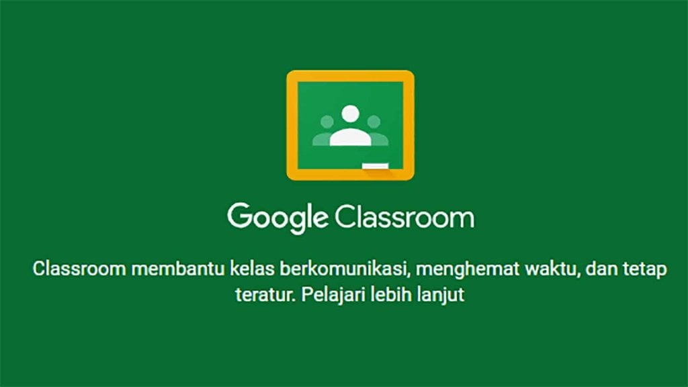
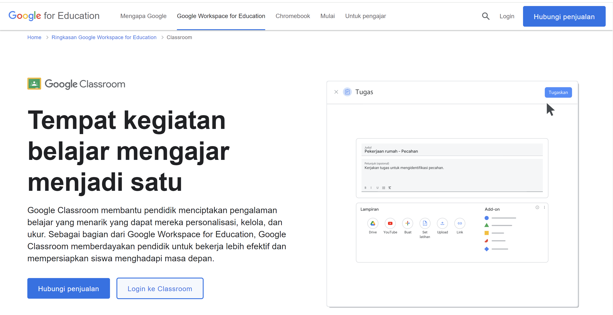
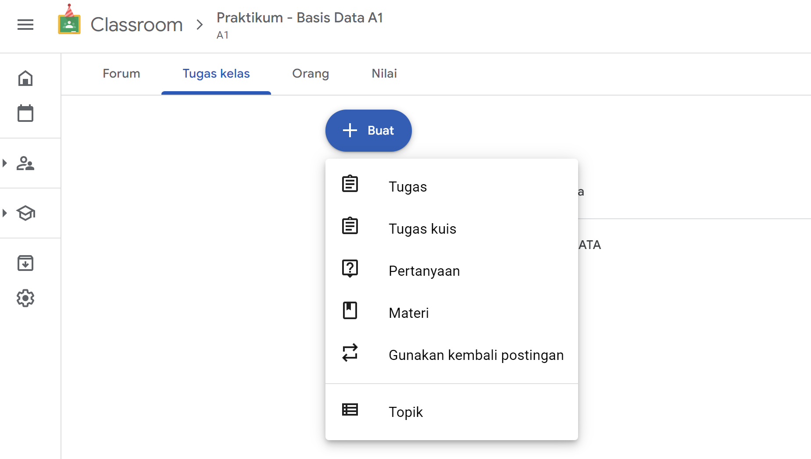

### Pengajaran Berbatuan Komputer 
### Nova Nor Alizhafya (2210131320001)

##
 

># GOOGLE CLASSROOM

Google Classroom adalah platform pendidikan gratis yang memungkinkan guru berinteraksi dengan siswa dan berbagi materi pendidikan dengan mudah. Guru dapat membuat kelas dan mengundang siswa ke platform, yang memungkinkan pembagian tugas, nilai, ujian, dan materi lainnya secara mudah [1]. Classroom merupakan platform pembelajaran gratis yang membantu dalam kegiatan mengajar dan belajar tanpa terbatas ruang dan waktu. Karena interaksinya dilakukan secara daring, sehingga kapan saja dan dimana saja pengajar maunpun siswa/mahasiswa dapat mengaksesnya selama terhubung ke internet.

Surya mengatakan bahwa belajar diartikan sebagai suatu proses yang dilakukan oleh individu untuk memperoleh perubahan perilaku baru secara  keseluruhan, sebagai hasil dari pengalaman individu itu  sendiri dalam berinteraksi dengan lingkungannya (Rusman dalam Muttaqin, et al., 2019).

Untuk menggunakan Google Classroom, guru dan siswa dapat mengakses menggunakan dua cara, yaitu website dan aplikasi. Untuk website dapat diakses menggunakan browser apapun seperti Chrome, FireFox, ataupun Internet Explorer. Sedangkan untuk aplikasi dapat diunduh secara gratis melalui Playstore untuk Android dan App Store untuk iOS (Mahardini, 2020).

Google Classsroom dikembangkan khusus untuk pengajaran jarak jauh yang memungkinkan para guru untuk mengatur dan menilai progres murid-muridnya  sambil tetap terhubung  dari mana pun juga, Google Classroom berbasis web yang dibuat untuk mempermudah kegiatan pembelajaran pendidik dan murid (Aliya dalam Sawitri, 2021). 

Pemberian tugas tanpa kertas mempermudah guru dalam mengoreksi dan tidak terlalu menghabiskan kertas yang akan digunkan untuk test atau semacamnya. Bergabung pada suatu kelas dapat memasukan kode kelas(minta kode dari guru tersebut) ataupun secara otomatis sudah di invite oleh guru yang bersangkutan (Sholeh, et al., 2021).

Efektifitas pembelajaran dengan google classroom dalam pendidikan, terutama bagi guru sebagai tenaga pendidik mengharuskan untuk dapat memanfaatkan teknologi. Dengan adanya teknologi, guru dapat lebih kreatif dalam menjalankan pembelajaran dengan menggunakan google classroom. Google classroom mempunyai kebermanfaatan dalam proses mengajar dikarenakan mampu meningkatkan intensitas pembelajaran secara interaktif dan komunikatif diluar jam belajar yang resmi (Septantiningtyas dalam Nainggolan & Manalu, 2021).

**Kunjungi laman Classroom melalui:** https://classroom.google.com/

##
 

>##  Google Classroom sebagai Tutor

Pembelajaran berbasis tutorial mengacu pada pemberian bantuan atau bimbingan materi yang terkait kepada siswa maupun mahasiswa. Bertujuan untuk membantu pemahaman dan kelancaran dalam proses pembelajaran.

Google Classroom sebagai tutorial berarti menggunakan platform Google Classroom untuk memberikan panduan atau instruksi pembelajaran secara terstruktur.

Pada platform Classroom dapat digunakan pendidik untuk memberikan video pembelajaran maupun modul pembelajaran sebagai panduan belajar.

Video pembelajaran dapat dibuat oleh pendidik ataupun membagikan video youtube dengan materi terkait. Begitupun dengan modul yang dapat menjelaskan suatu konsep pembelajaran.

 

>##  Google Classroom sebagai Tool

Tool merupakan alat untuk melakukan suatu pekerjaan. Dalam hal ini Classroom  berperan sebagai alat yang dapat memudahkan dalam pembelajaran tanpa terbatas ruang dan waktu, dimana materi pembelajaran yang tersedia dapat kapan saja dan dimana saja diakses.

 

Selain itu, Classroom dapat membatu pendidik dalam mengelola kelas secara digital, seperti menilai tugas.

Classroom juga terintegrasi dengan Google Drive, Docs, Sheets, dan Slides yang membantu dalam mengerjakan tugas ataupun mengedit dokumen.

Dengan beberapa fitur yang tersedia seperti: pengumuman, komentar, forum diskusi, hingga kalender yang juga berperan penting dalam pengelolaan kelas.

 

>## Google Classroom sebagai Tutee

Tutee dalam konteks Pendidikan merupakan siswa/mahasiswa yang menerima pengajaran atau bimbingan. Sedangkan dalam konteks Teknologi, Tutee merupakan sistem atau model yang dapat mempelajari data dalam interaksi yang terjadi untuk meningkatkan fungsionalitasnya.

Dalam interaksinya Google Classroom belum dapat memberikan rekomendasikan konten secara otomatis terkait materi yang ada. Namun secara manual, pendidik dapat memanfaatkan berbagai fitur yang tersedia untuk mendukung proses pembelajaran.

Selain itu, umpan balik diterima oleh Classroom untuk mendukung pengalaman belajar dan meningkatkan fungsionalitasnya.

 

>## Kelebihan dan Kekurangan Google Classroom

**Kelebihan** dari penggunaan google classroom antara lain penguasaan IT guru dan siswa meningkat. Guru dapat menggunakan berbagai media untuk proses pembelajaran, baik yang terdapat dalam Google Classroom atau media lain yang bisa ditautkan pada classroom tersebut (Mahardini, 2020). 

Sedangkan **kekurangannya** yaitu permasalahan jaringan maupun keterbatasan kuota yang dimiliki peserta didik bisa menjadi penghambat dalam proses pembelajaran, pun begitu pula dengan rendahnya tingkat keaktifan peserta didik dalam proses pembelajaran (Mahardini, 2020).

  

## 

># SUMBER
 
[1] Google Classroom. (n.d.). https://g.co/kgs/yhkE9hy

Mahardini, M. M. A. (2020). Analisis situasi penggunaan google classroom pada pembelajaran daring fisika. Jurnal Pendidikan Fisika, 8(2), 215-224.

Muttaqin, A., Fatirul, A. N., & Hartono, H. (2019). Pengembangan Modul Perubahan Lingkungan dan Daur Ulang Limbah Berbasis Discovery Learning Melalui Media Google Classroom. Jurnal Pijar Mipa, 14(2), 60-67. https://doi.org/10.29303/jpm.v14i2.1292

Nainggolan, A. P., & Manalu, R. B. B. (2021). Pengaruh Penggunaan Google Classroom Terhadap Efektifitas Pembelajaran. Journal Coaching Education Sports, 2(1), 17-30. 

Sawitri, D. (2021). Penggunaan Google Classroom bagi Para Guru di Lingkungan Perg. Muhammadiyah MTS Cabang Medan Baru. Prioritas: Jurnal Pengabdian Kepada Masyarakat, 3(01), 38-46. https://doi.org/10.35447/prioritas.v3i01.380

Sholeh, M., Murtono, M., & Masfuah, S. (2021). Efektivitas pembelajaran google classroom dalam meningkatkan kemampuan literasi membaca siswa. Jurnal Educatio Fkip Unma, 7(1), 134-140.

